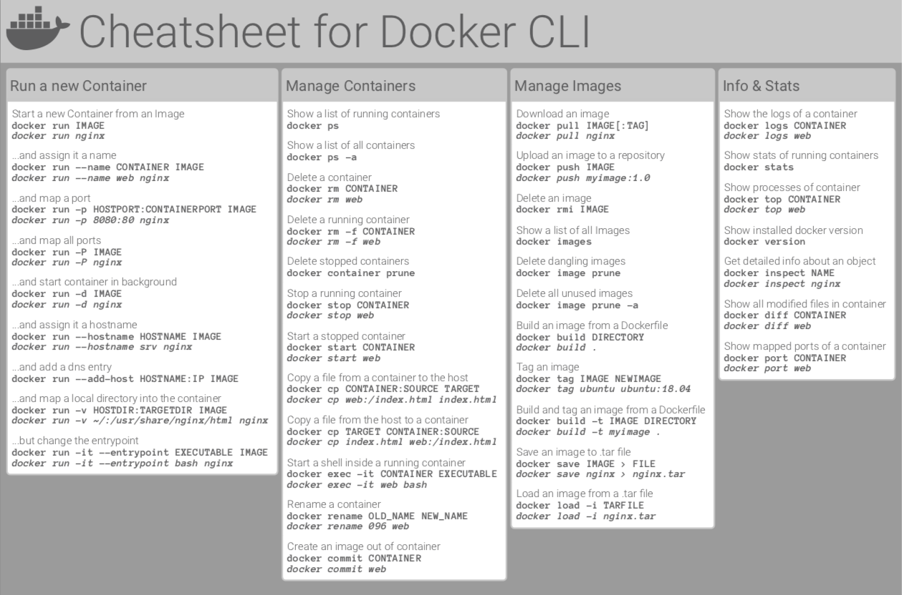

# 🚀 Docker Documentation


## 🌟 Overview
Welcome to the **Docker Documentation Repository**! This repository contains comprehensive information about **Docker**, covering **installation, setup, commands, best practices, and troubleshooting** to help you master containerization efficiently. 

---
## 📂 Folder Structure
```
docker-docs/
│── README.md                      # Overview of the documentation
│── images/                        # Folder containing images used in documentation
│   ├── docker-installation.png    # Docker installation image
│   ├── docker-overview.png        # Docker overview image
│   ├── docker-commands.png        # Docker commands reference image
│   ├── docker-best-practices.png  # Docker best practices image
│   ├── docker-troubleshooting.png # Docker troubleshooting image
│── introduction/                  # General introduction
│   ├── INTRODUCTION.md            # What is Docker? Why use it? Key components
│   ├── ARCHITECTURE.md            # Docker architecture explanation
│── setup/                         # Installation and setup guides
│   ├── INSTALLATION_AWS_EC2.md    # Installing and configuring Docker on AWS EC2
│── commands/                      # Docker commands reference
│   ├── BASIC_COMMANDS.md          # Basic Docker commands
│   ├── ADVANCED_COMMANDS.md       # Advanced Docker commands
│   ├── DOCKER_COMPOSE.md          # Commands specific to Docker Compose
│   ├── NETWORKING.md              # Docker networking commands
│   ├── VOLUMES.md                 # Docker volume management commands
│   ├── CHEAT_SHEET.md             # Docker Cheat Sheet
│── best-practices/                # Docker best practices and security
│   ├── DOCKER_SECURITY.md         # Security best practices
│   ├── DOCKERFILE_BEST.md         # Best practices for writing Dockerfiles
│── troubleshooting/               # Common Docker issues and fixes
│   ├── TROUBLESHOOTING.md         # General troubleshooting guide
│   ├── COMMON_ERRORS.md           # List of common Docker errors and solutions
```

---
## 🚀 Getting Started
### 🛠 1. Install Docker

- [Installation on AWS EC2](setup/INSTALLATION_AWS_EC2.md)

### 📖 2. Learn the Basics
- [Introduction to Docker](introduction/INTRODUCTION.md)
- [Docker Architecture](introduction/ARCHITECTURE.md)

### 🖥️ 3. Use Docker Commands

- [Basic Commands](commands/BASIC_COMMANDS.md)
- [Advanced Commands](commands/ADVANCED_COMMANDS.md)
- [Docker Compose Commands](commands/DOCKER_COMPOSE.md)
- [Docker Cheat Sheet](commands/CHEAT_SHEET.md)

### 🔒 4. Follow Best Practices

- [Docker Security](best-practices/DOCKER_SECURITY.md)
- [Writing Efficient Dockerfiles](best-practices/DOCKERFILE_BEST.md)

### 🛠 5. Troubleshoot Issues
- [General Troubleshooting](troubleshooting/TROUBLESHOOTING.md)
- [Common Errors & Fixes](troubleshooting/COMMON_ERRORS.md)

---
## 🤝 Contributing
We welcome contributions! Fork this repository, make your improvements, and submit a pull request. 🚀

## 📜 License
This project is open-source and available under the [MIT License](LICENSE).

---
## 🔗 Connect with Me
🌐 **Portfolio**: [sudarshangawande.com](https://sudarshangawande.com)  
💼 **LinkedIn**: [Sudarshan Gawande](https://www.linkedin.com/in/sudarshan-gawande/)  
📧 **Email**: [sudarshangawande98@gmail.com](mailto:sudarshangawande98@gmail.com)  
🔗 **GitHub**: [Sudarshan Gawande](https://github.com/sudarshan-gawande)  

💙 *Thank you for visiting! Happy Dockering! 🐳*